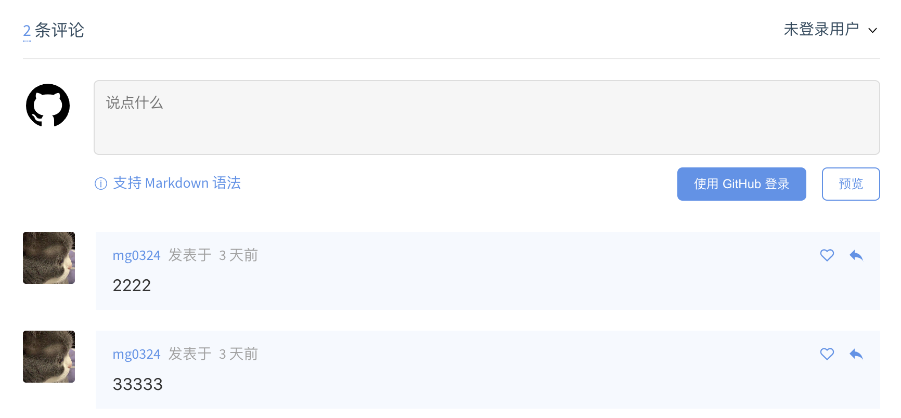

# docsify-gitalk
docsify gitalk plugin，集成gitalk评论插件！

[](https://www.npmjs.com/package/docsify-gitalk)




## Usage
1. 先申请 [GitHub Application](https://link.zhihu.com/?target=https%3A//github.com/settings/applications/new)，保存id和secret

2. Configure docsify-gitalk:(配置 ）

    ```html
    <script>
    window.$docsify = {
      // gitalk评论
      gitalk: {
        clientID: 'a80e57a9ad7a92dd2c8d',
        clientSecret: 'c38424e2af55c1549f52de1564eb71b4a94c10ea',
        repo: 'docsify-note-02',
        owner: 'mg0324',
        admin: ['mg0324']
      }
    }
    </script>
    ```

3. Insert script into docsify document:

    ```html
    <!-- GitTalk评论 -->
    <link rel="stylesheet" href="//cdn.jsdelivr.net/npm/gitalk/dist/gitalk.css">
    <script src="//cdn.jsdelivr.net/npm/docsify/lib/plugins/gitalk.min.js"></script>
    <script src="//cdn.jsdelivr.net/npm/gitalk/dist/gitalk.min.js"></script>
    <script src="https://unpkg.com/docsify-gitalk@1.0.0/dist/docsify-gitalk.min.js"></script>
    ```
